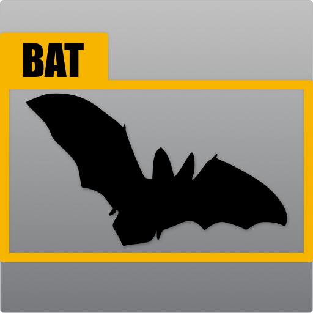

<!-- PROJECT LOGO -->
<br />
<p align="center">
    
  </a>

  <h3 align="center">README</h3>
</p>


<!-- TABLE OF CONTENTS -->
## Table of Contents

* [About the Project]
* [Installation]
* [Usage]
* [Contributing]
* [Credits]
* [License]


<!-- ABOUT THE PROJECT -->
## About The Project
BAT is a tool used to annotate pictures and to get your pictures annotated.
Since our project is in the early stages, expect to see a lot of changes in the next few weeks.
Created for the module "Scalable Systems" at TU Berlin.


### Built With

* [Python](https://www.python.org/)
* [Bootstrap](https://getbootstrap.com)
* [Django](https://www.djangoproject.com/)
* [Docker](https://www.docker.com/)


<!-- Installation -->
## Installation

To get a local copy up and running follow these simple steps.

* Python
Download lastest version at https://www.python.org/downloads/ and follow the installation instructions
(It is recommended to use a [virtual environment](https://virtualenv.pypa.io/en/stable/index.html) with python, but is not mandatory)

* npm
```sh
npm install npm@latest -g
```

* Django
```sh
pip install django
```

* Bootstrap
```sh
npm install bootstrap
```

* Pillow
```sh
pip install pillow
```

1. Clone the repo
```sh
git clone https://frankkohlhepp/BAT.git
```
2. Start the server
```sh
YourPathToTheProject\BAT\batproject python manage.py runserver
```
<!-- Docker install-->
### Installing with Docker

1. Install [docker here](https://docs.docker.com/get-docker/) and make sure it's running on your system.

2. Install [docker-compose](https://docs.docker.com/compose/install/) 

You can also use `pip`
```sh
pip install docker-compose
```
OR without using a `virtualenv`:
```sh
sudo pip install docker-compose
```
3. Clone the repo
```sh
git clone https://frankkohlhepp/BAT.git
```
4. (Linux) Make `deploy.sh` exacutable:
```sh
chmod +x deploy.sh
```
5. (Linux) Run `deploy.sh` with:
```sh
./deploy.sh
```
6. (Optional) In `deploy.sh` comment out line 8 (with `#`) `cp docker/settings.py batproject/batproject/settings.py` to use non deployment settings (eg.: `DEBUG = True`)


<!-- Usage -->
## Usage

Open http://localhost:8000/batproject in any browser and you will see a local version of BAT.
In the next weeks, we are adding the possibility to host the server on docker and other platforms.


<!-- Contributing -->
## Contributing

Since open source project are about contributing to projects, feel free to fork our repository.

If you want to develop any new features, make sure to open a new branch and to always keep your repository up to date.

After you have changed something or finished your new feature, make sure to commit your changed and make a pull request.

Any member of our development team is allowed to merge pull requests.


<!-- Credits -->
## Credits

Product Owner: Markus Städler

Scrum-Master: Louis Loechel

QA: Felix Dannenberg

Frontend: Gergana Vladimirova, Frank Kohlhepp

Backend: Henning Schaaf, Vincent Spell

DevOps: James Laycock


<!-- License -->
## License

Distributed under the MIT License. See [LICENSE](https://github.com/frankkohlhepp/BAT/blob/master/LICENSE) for more information.
